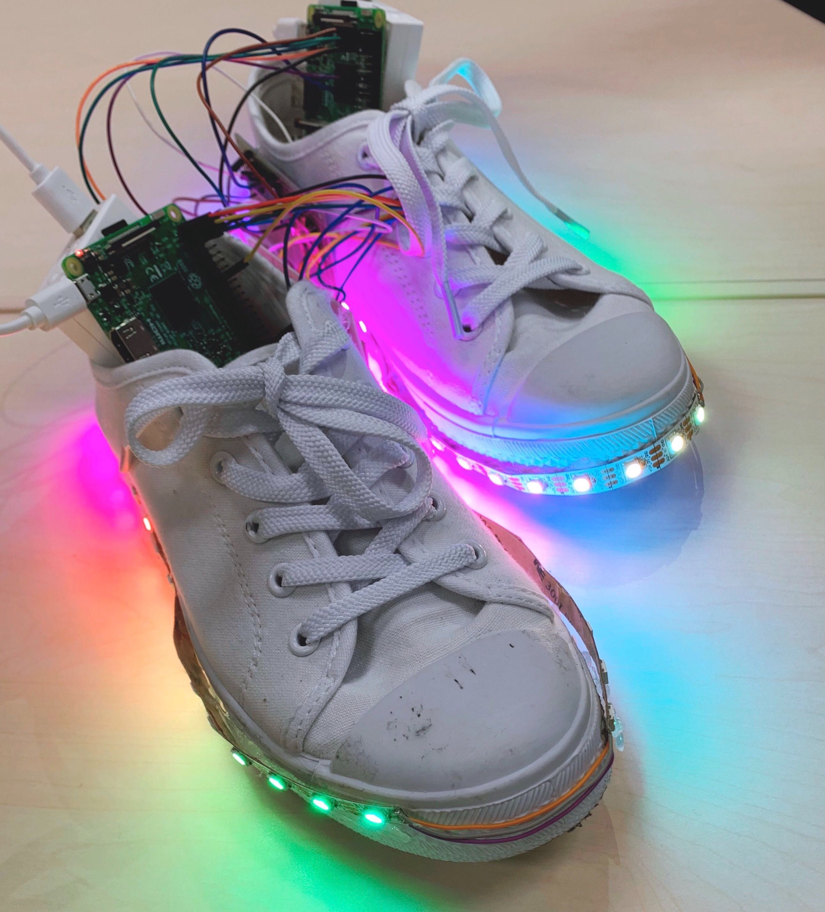
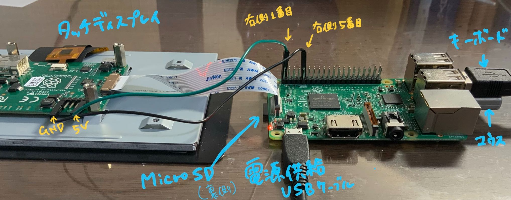
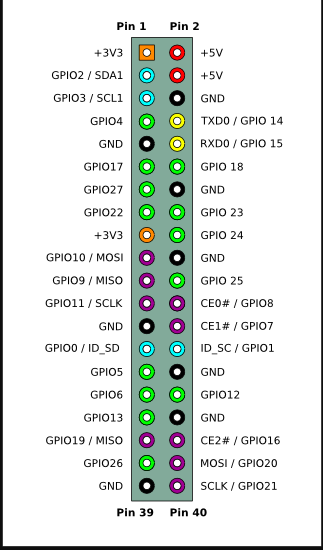
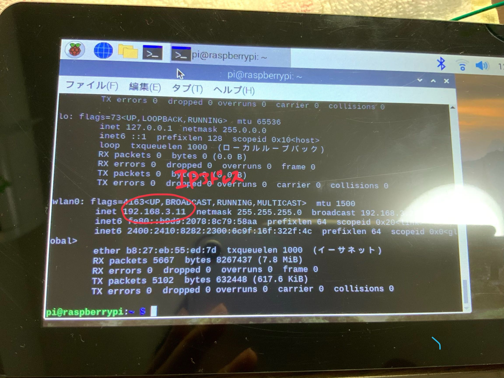
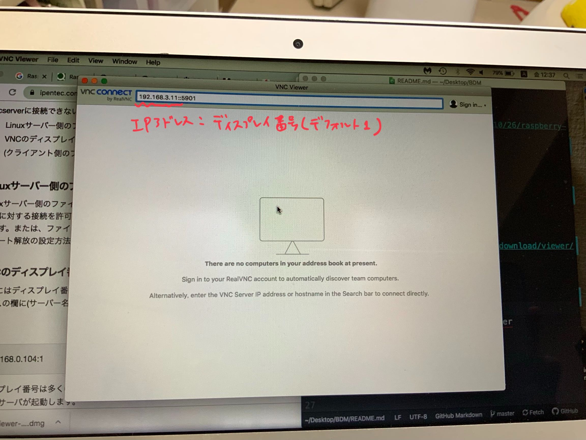
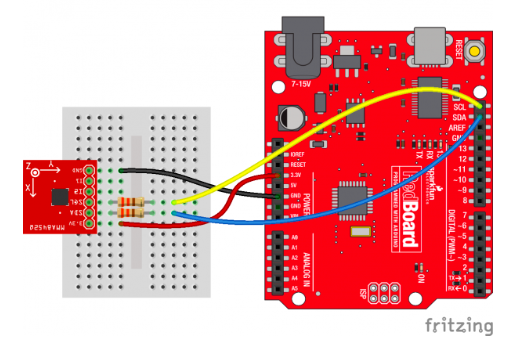
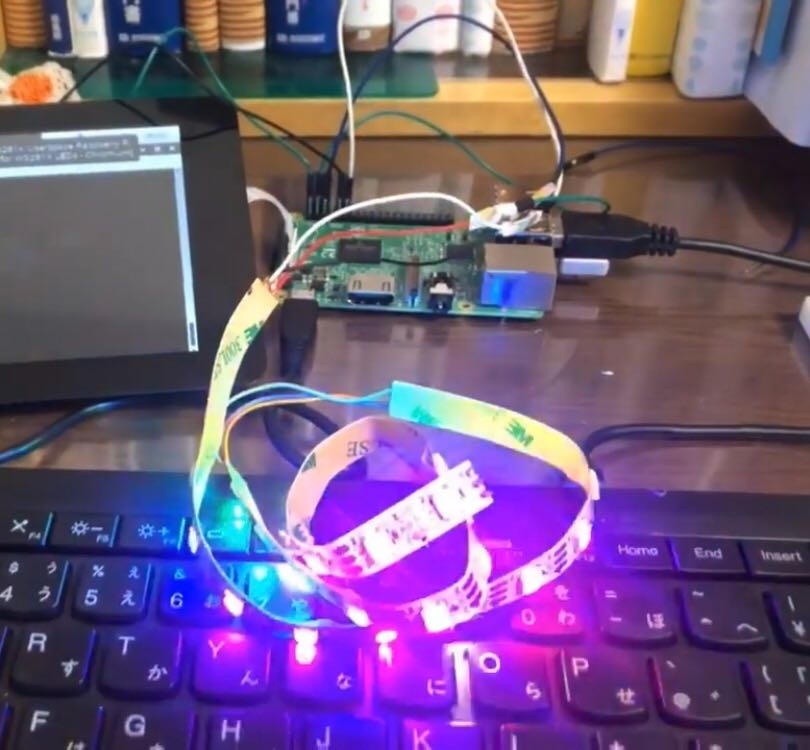
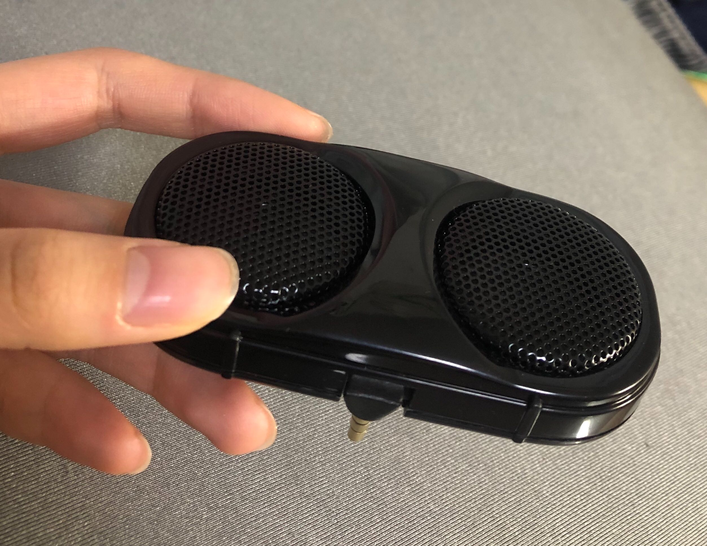

# DisShoes
完成作品の動画は[こちらをクリックして](https://youtu.be/m2iPEg8bOUQ)見てください。<br>
@ayarimatsui と２人で作ったBDM（ビックリドッキリメカ）です。毎日歩くのが楽しくなる！そんな靴を目指しました。<br>
<br>

### Raspberry piの基本
**初めに用意するもの<br>**
Raspberry pi 本体<br>
Rapberry pi用タッチディスプレイ<br>
Rasberry piに電源を供給するケーブル<br>
Micro SD<br>
USB付きマウス<br>
USB付きキーボード<br>

**[Micro SDなどのセットアップ](https://deviceplus.jp/hobby/raspberrypi_entry_056/
)**

**ディスプレイとの接続**<br>
* [繋ぎ方はこのページが参考になる](https://iot.nifcloud.com/blog/2015/10/26/raspberry-pi-display/)
* 繋ぎ方の図↓


**Raspberry pi3　ピンの位置**<br>

<br>

**インストール編**
* matplotlib<br>
  * python3なら`pip3 install matplotlib`<br>
  * python2なら`sudo apt-get install python-matplotlib --fix-missing`
* pygame<br>

**Raspberry piでGitHub**
```bash
sudo apt-get install git
cd /etc
sudo git init
sudo git config --global user.email "~.com"
sudo git config --global user.name "MiyabiTane"
```
これで初期設定完了。PCと違うのはsudoが必要なところ<br>
`git clone 持ってきたいレポジトリのページのURL`でレポジトリをローカルに持ってきてそこにファイルを追加し、
```bash
sudo git add ファイル名
sudo git commit -m "コメント"
```  

### Raspberry piとMacを接続
* まずアプリをインストール :
[アプリのURL](https://www.realvnc.com/en/connect/download/viewer/)
* 実行するコード<br>
<Raspberry pi側の操作>
```
sudo apt-get update
sudo apt-get upgrade
```
Wi-fiに繋がっていることを確認してから
```
sudo apt-get install tightvncserver
tightvncserver　（パスワード設定）
```
<Mac側の操作><br>
  * アプリの立ち上げ<br>
  * ウィンドウにラズパイのIPアドレスを打ち込む
  * 先ほど指定したパスワードを入れる<br>
  ＊IPアドレスはこれ<br>
  <br>
  ＊ディスプレイ番号が必要なので要注意<br>
  <br>   
<br>

### 加速度センサ　MM8452Q
* 繋ぎ方↓<br>



#### 加速度検出　\~エラー解決編~
**case 1**<br>
bus=smbus.SMBus(1)<br>
[Error] No such file or directory<br>

 **解決法**<br>
Raspberry piのターミナルに<br>
`raspi-config`
を打ち込んで出てきた画面で<br>
5 Interfacing Options ▶︎ P5 I2C ▶︎ <はい＞の順に選択。<br>
リブートしてやり直す。<br>

**case 2**<br>
I/O error<br>
▶︎ センサとの接続がうまく言っていないときにおこるエラー<br>

**解決法**<br>
　 まず以下をRaspberry piのターミナルに打ち込んでみる。<br>
`i2cdetect -y 1`<br>

 ▶︎ 全てが`--`になっているとき<br>
センサとの接続が出来ていない。抑えながらやったり、回路を組み直したり、電源を抜いてやり直したりしてみる。<br>
▶︎`--`でない箇所があるとき<br>
何かしらの文字（○○とする）が入っている部分がセンサからの入力がきている部分なので、自分の書いたプログラムで　I2C_ADDR=0x○○　が正しく記入されているかを確認する。

### フルカラーシリアルLEDテープ
[このページに載っているGitHubのコードをダウンロード！](http://jellyware.jp/kurage/raspi/led_stick.html)<br>
ロジック変換しないでもいけてしまった...。<br>
上記サイトの"回路結線図"以降を参照。
strandtest.pyの中身を応用すれば良さそう！加速度の結果とどう結びつけるかは後日検討。<br>



### スピーカー　
Raspberry piのイヤホンジャックに刺せるタイプのものを購入。Raspberry piの音声出力をイヤホンジャックに設定しておく。<br>
<br>

[pygameを使ってRaspberry piで音を鳴らす。](https://qiita.com/Nyanpy/items/cb4ea8dc4dc01fe56918)<br>

音源編集について、音源のボリュームを変えたい時は[ボリューム変換ページ](https://www.mp3louder.com/jp/)、長さを編集したい時は[音源カッターのページ](https://mp3cut.net/ja/)を使うと良い。<br>

**スピーカー　SP23MM**<br>
~~裏面左側を3.3V、右側をGNDに接続したらジージー音を立てた...。~~イヤホンジャックに接続すれば鳴らせるけど音が小さいので却下。<br>
  [このスピーカーについて（接続方法など）](https://nobita-rx7.hatenablog.com/entry/27796888)<br>

#### スピーカーの音が鳴らない！　\~エラー解決編~
**case 1**<br>
スピーカーが接続できていない。<br>

**確認方法(USBタイプのみ)**
```bash
lsusb
```
と打って、例えば
```bash
Bus 001 Device 004: ID 8086:0808 Intel Corp.
・・・
Bus 001 Device 006: ID 04f2:0939 Chicony Electronics Co., Ltd
・・・
```
のように出力されればBus 001 Device 006: ID 04f2:0939 Chicony Electronics Co., Ltd　として認識されていることがわかる。<br>

**case 2**<br>
Raspberry piのオーディオ設定ミス

**解決法**<br>
出力先をHDMIに設定<br>
```bash
amixer cset numid=3 index
```
index=0:自動、index=1:アナログ出力（ヘッドホンジャック）、index=2:HDMIとなっている。次に<br>
```bash
sudo raspi-config
```
して 7 Advanced Options ▶︎ A4 Audio ▶︎ 上で選んだもの の順に選択する。<br>

* HDMIから音が出ない場合、/boot/config.txt を編集して hdmi_drive=2 としてリブートする。<br>

[このサイトも参考になる。](https://iot-plus.net/make/raspi/speaker-open-jtalk-japanese-speech/)<br>
